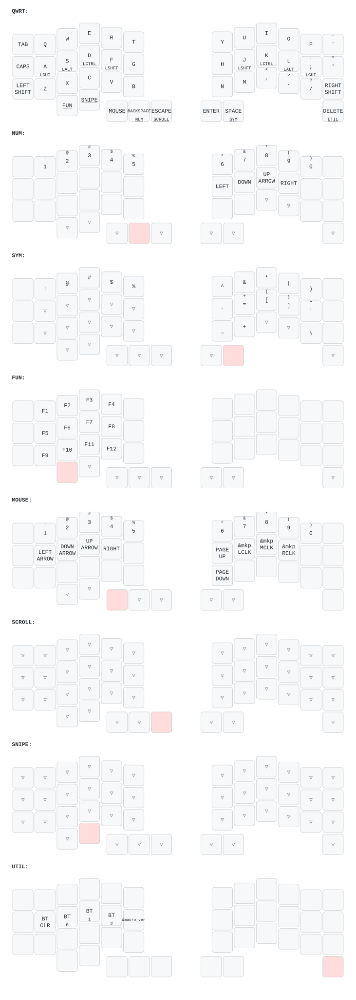

# Keyball44 Keymap

Source of truth: `config/keyball44.keymap`. The graphic below is generated
from it - after any keymap change run `bin/draw_keymap.sh` to regenerate
`img/keymap.svg` (uses [keymap-drawer](https://github.com/caksoylar/keymap-drawer)
via uvx, the same tool mochukeeb used for their layout images).

## How to read it

- Small text under a key = its hold behavior (e.g. `A` / `LGUI` = tap types
  a, hold is Cmd). Underlined = hold-only layer switch.
- `▽` = transparent (falls through to the layer below); blank = dead key.
- The pink key on a layer = the key being held to reach that layer.

## Thumb cluster (tap / hold)

| Key | Tap | Hold |
| --- | --- | --- |
| left outer | LGUI | - |
| left 2nd | - | SNIPE (slow trackball) |
| left 1st angled | - | MOUSE |
| left middle angled | Backspace | NUM |
| left inner angled | Escape | SCROLL (trackball scrolls) |
| right inner angled | Enter | - |
| right outer angled | Space | SYM |
| right by-trackball | Delete | UTIL |

## Behaviors

- **Homerow mods** (GACS: A=GUI S=Alt D=Ctrl F=Shift, mirrored on J K L ;):
  ported from the Adv360, urob timeless-HRM recipe - balanced flavor,
  tapping-term 280, quick-tap 175, require-prior-idle 150,
  hold-trigger-on-release, opposite-hand-only trigger positions. Mods fire
  on pause-then-reach-across; same-hand rolls always type letters.
- **macro_ver** (UTIL layer, G position): types the firmware build stamp
  `YYYYMMDD-<branch>-<commit>-kb44`. An `x` after the commit hash means the
  build came from a dirty tree (unverified experiment). Throttled to 30ms
  per key so cold Bluetooth links don't drop characters.
- **BT_CLR** (UTIL layer, A position): forgets the pairing of the ACTIVE
  profile - it sits next to the profile-select keys, mind the reach.

## Trackball layers (driver-side effects; bindings alone look empty)

- **MOUSE**: hold left 1st angled thumb, or auto-activates on deliberate
  ball movement (threshold 20) for 700ms. Clicks on J/K/L =
  left/middle/right.
- **SCROLL**: hold left inner angled thumb (Escape); ball motion becomes
  scrolling.
- **SNIPE**: hold left 2nd thumb; ball CPI drops 1200 -> 400 for precision.

## Known gaps / ideas

- FUN layer (F1-F12) is UNREACHABLE: no activator points at it (its own
  `&mo 3` is dead code). Wire a trigger before relying on it.
- Left Ctrl has no dedicated key (D/K holds only); CAPS took its spot.
- SYM left hand and NUM right hand are free real estate.
- caps_word is configured (`continue-list` includes `_` and `-`) but bound
  to no key.
